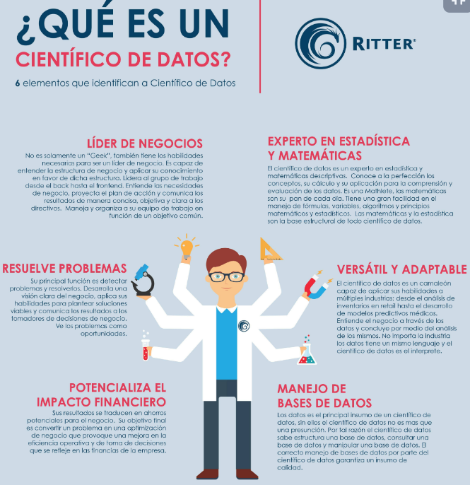

# ANÁLISIS DE NEGOCIOS PARA CIENCIA DE DATOS

[Version en notion](https://www.notion.so/AN-LISIS-DE-NEGOCIOS-PARA-CIENCIA-DE-DATOS-4b2a82bc347f4f89beb4d07f844c2332) 

- GENERALIDADES
    
    Científico de datos: Persona que sabe más de estadística que cualquier programador y que a la vez sabe más de programación que cualquier estadístico. Profesional dedicado a analizar e interpretar grandes bases de datos. 
    
    ■Recopilar grandes cantidades de datos revueltos y transformarlos a un formato más utilizable.
    ■Resolver problemas relacionados con negocios empleando técnicas basadas en datos.
    ■Trabajar con diversos lenguajes de programación, incluidos SAS, R y Python.
    ■Dominar técnicas analíticas como el machine learning, deep learning y analítica de texto.
    ■Buscar orden y patrones en datos, además de detectar tendencias que puedan ayudar a la base de
    operación de una empresa.
    
    
    
    ¿Qué es ciencia de datos y big data? ¿cómo afectan a mi negocio?:
    
    El big data es:
    
    - Gran volumen de información. Datos grandes pero no hay una definición específica.
    - Las empresas almacenan datos diariamente. Las empresas tienen información de todo tipo (clientes, ventas, operaciones, empleados, precios) muy importantes, pero si no actuamos no podemos utilizarlas; de aquí surgió los especialistas en data, que nos van a ayudar a convertir esta información en acciones
    - Costos, eficiencia, entender a los clientes
    - Solución matemática a un problema de negocio.
    - El big data nos va a servir para crear un puente de comunicación entre la empresa y los usuarios finales.
    
    3 empresas que están usando el Big Data: Nacional de chocolate, Google, Pinterest
    
    Tipología de datos - que tipos de datos se usan:
    
    - Personas: los generamos nosotros. Por ejemplo, cuando damos like a una foto de facebook, podrías estar almacenando esta información de tus preferencias de ciudades, calles, edificios, individuos.
    - Transacciones: existen 2 tipos de transacciones:
        - Monetarias: existe un flujo económico de por medio. Por ejemplo, cualquier transacción que hagamos con nuestra tarjeta de crédito o débito, un pago electrónico digital queda una huella. Dejan un registro de quien lo hizo, el monto y donde. A partir de esto s realizan sugerencias según las preferencias.
        - No monetarias: no financiero. Por ejemplo, las compañías telefónicas que identifican tu patrón habitual (cuantas llamadas haces, a qué personas llamas, cuanto tiempo duran tus llamadas) y cuando identifican un comportamiento anómala identifican que es probable que abandones la compañía, por lo que empiezan a llamarte constantemente para que no abandones.
    - Navegación web: las famosas cookies, que incluyen todos los términos y condiciones de la página, están advirtiendo del registro que van a hacer, útil para los que tienen dominio de página web. De esta manera se conoce quien accede a la página, de qué país proviene, qué género tiene, etc.
    - Machine 2 machine: es una conexión de una máquina con otra máquina. Por ejemplo, los dispositivos de GPS o geolocalización, los cuales las compañías de transporte los usan e identifican donde estás y donde puede estas el conductor más cercano y hacer la locación de dispositivos según distancia.
    - Biométricos: uno de los más relevantes. Son los que te identifican como ser único, saben quien eres y cuales son los genes que te identifican como persona. Por ejemplo, la sangre, la saliva, huella dactilar, desbloqueo facial de celulares.
    
    Pasos para empresas data-driven - “dejar de basarnos en información no digital”:
    
    1. Crear una cultura de datos: hacer que todos los empleados tomen decisiones basadas en datos; para ello hay que enseñarles qué son los datos.
    2. recolectar información, almacenarla y procesarla
    3. Medir todo: medir y entender y clasificar. Entender la cantidad de registros, la velocidad de crecimiento de la información
    4. Datos relevantes y precisos: identificar qué es lo relevante y lo que nos sirve para el caso de estudio, que los datos sean precisos y exactos. Nuestra intuición es la hipótesis
    5. Testear y crear hipótesis: pensar en una pregunta más específica para la hipótesis.
    6. Desde los insights de datos a las acciones: las acciones están basadas en los datos.
    7. Cumplir las regulaciones de datos: no puedes tomar decisiones sesgadas en función a algo externo. La ética en los datos es muy importante.
    8. Automatizar: el estudio se debe hacer una vez y ponerlo a replicar cada vez que se quiera validar esta hipótesis 
    - Machine Learning
        
        hace 50, originado por IBN quienes desarrollaron un algoritmo para retar a una máquina con el mejor jugador del mundo de ajedrez para que la máquina mejorara y replicara las jugadas de esta persona. En el primer día la máquina perdió, pero al siguiente día esta había entrenado 24 horas el juego (lo podía replicar, entender y predecir) pero el humano ganó la partida, después de eso quedó 2 horas más registrando, procesando y **prediciendo** esta partida; en la tercera partida la máquina venció y nadie más ha logrado vencerla. Esto es la inteligencia artificial.
        
        El aprendizaje automatizado o machine learning es que, una vez que la máquina es inteligente, queremos que lo sea de una manera procesada y que pueda perfeccionarse.
        
        El machine learning replica los movimientos, los perfecciona y entiende quién está atras.
        
        Algo mucho más avanzado es que, no solo vamos a analizar los datos de muchos tipos, sino que vamos a tener una base de datos profunda (deep learning) porque nosotros transformamos un punto de imagen en un dato útil.
        
        Funciones (ejemplos) del Machine learning o lenguaje automatizado - para qué se utiliza
        
        - Detección de fraudes: los fraudes son de muchos tipos, pero la mayoría es de las ventas virtuales. Nuestro algoritmo detecta quien hizo una acción fraudulenta y bloquea la cuenta de ser necesario.
        - Búsqueda web: si haces algo, vas a recibir ciertos tipos de búsqueda. Sugerencias a partir de búsquedas.
        - Anuncios a tiempo real: yo hago una compra y me hacen otra compra en el momento en que ya había finalizado mi necesidad de consumo. Sugerencias de compra cuando estamos en el carrito de la tienda online.
        - Análisis de textos: no estas midiendo solo números o intentar vender más o gastar menos, sino que estás tratando información categórica, de lo que escriben los usuarios
        - Next best action: la siguiente mejor acción. Consiste en saber qué está haciendo tu cliente, en qué fase de su ciclo de vida está y cual va a ser su siguiente movimiento para darles información que sea de su interés. Es ser proactivos con las información a partir de la evolución de los usuarios.
    - Deep learning
        
        Una máquina acierta el 99% de las ocasiones qué tipo de imagen está interpretando, en cambio los humanos acertamos el 95% de las veces y este ratio no es constante (disminuye con las horas a raíz de nuestro cansancio). Por ejemplo, shazam, que sirve con la transformación: llegan a un proceso en que interpreta un sonido, una frecuencia y lo transforma en código binomial, por lo que con tan solo 5 segundos ya ha transformado este sonido con una cantidad de unos y ceros que ya, dentro de la base de datos, identifica cual es la canción; también identifica el patrón y nos puede hacer recomendaciones de canciones parecidas.
        
        Otro ejemplo es tesla y los carros automatizados; las imágenes que todo lo que va apareciendo en frente del vehículo es transformada e interpretada y, al final lo que identifica el carro son unos ceros, donde uno es sigue adelante y el cero es para. Por ejemplo, el código 1 sería una caja de cartón y un 0 sería una persona.
        
- FASES, ROLES Y OPORTUNIDADES LABORALES.
    
    Roles en datos:
    
    
    
    1. Ingeniero o arquitecto de datos: es el primero, el origen de los datos, el que genera el entorno de información. Esta persona hace la conexión entre un dispositivo y la creación de una base de datos. Es esencial para que podamos almacenar la información. Trabajan haciendo appis, etls, conectores. Las herramientas más usadas para ellos es SQL y noSQL. Crean la base de datos.
    2. Analista BI (business intelligence): A partir de la información que creó el ingeniero de datos la extrae y la lee quitando la información que le interese y explica la situación de la empresa. Crea cuadros de control, dashboards, monitoreo; va a automatizar estos procedimientos para que cualquier persona pueda interpretar la información que se está generando. Las herramientas más usadas son Excel y SQL.
    3. Data scientist o científico de datos: persona que sabe hacer el rol del analista y aparte sabe predecir (futuro); explica el futuro con estadística y modelos. Las herramientas más usadas son R y Python. El data scientist sabe también usar SQL pero el analista no sabe necesariamente usar R y Python.
    4. Data translator: el que va a liderar este equipo. Esta persona puede ser alguien muy técnico que nos va a ayudar a proyectar el equipo o puede ser una persona especialista en negocio que entienda un poco de datos pero no necesariamente que sea una persona técnica. Al final lo que se busca es una persona que pueda interpretar los datos y pueda comunicarnos con los otros equipos del negocio. Son destiladores de data y expertos en necesidad de negocio, por lo que nos van a guiar en cada uno de los procedimientos de los datos y en enfocar mejor tus análisis.
    
    Programas más usados en cada etapa del estudio de la información:
    
    - Extracción de información con SQL:
        - Para el rol del analista e ingeniero. Crean bases de datos y las sintetizan.
        - Nos ayuda a extraer información.
        - Sintetiza una base de datos pequeña o gigante, lo cual nos sirve para entregar cuadros de control de la operación. Estos cuadros son una evolución en un gráfico, una síntesis de como nos va, nos fue en el pasado para poder comparar.
        - Un ejemplo claro es un embudo.
    - Análisis y visualización con R y Python:
        - Son las que usa el científico de datos.
        - Son herramientas exploratorias, predictivas y se basan en modelos estadísticos y matemáticos según como los programemos.
        - Nos van a servir para hacer gráficos o visualización.
        - Análisis descriptivo: describir la información que ya tenemos, interpretarla, saber cuanta información hay
        - Análisis exploratorio: nos sirve para poder predecir la información.
        - R:
            - Análisis de datos con enfoque estadístico
            - Más complejo al inicio
            - Análisis descriptivo y exploratorio
            - Packages:
                - ggplot2: sirve para hacer gráficos muy visual
                - dplyr: sirve para reorganizar nuestra información.
        - Python:
            - Análisis de datos con enfoque en ingeniería
            - Parecido a otros lenguajes
            - Análisis descriptivo y exploratorio
            - Packages o librerías:
                - Pandas y Numpy: nos sirven para reorganizar la información, ser mucho más eficientes y no tener que escribir tanto código para interpretar nuestros datos.
- SQL
    
    Bases de datos
    
    Toda la información de la empresa queda almacenada, esto se convierte en una tabla que tiene columnas y filas. Las columnas pueden ser muy diversas. Todo este conjunto de tablas conforman una base de datos. 
    
    Instrucciones de comandos SQL:
    
    - Comando SELECT: Selección de los campos (columnas) para hacer el análisis o para sintetizar la tabla de origen.
    - Cláusulas:
        - FROM: Tabla donde se almacena la información. con el SELECT y el FROM ya creamos un query completo.
        - WHERE: especifica las condiciones
        - GROUP BY: campos (columnas) de agrupación. Va a servir para hacer una condición agrupada por una de las columnas.
        - ORDER BY: Campos (columnas) de ordenación. Nos sirve para ordenar los datos.
        - Operadores lógicos:
            - AND: une varias condiciones que tienen que ser cumplidas para obtener resultados.
            - OR: Evalúa dos o más condiciones y obtienes resultados si una de ellas se cumple
            - NOT: Excluye un valor de la información a obtener.
    - Funciones agregadas:
        - AVG: Promedio (average) de un campo (columna).
        - COUNT: Recuento de valores de una columna
        - DISTINCT: Encontrar valores únicos.
        - SUM: Suma de valores de una columna.
        - MAX: Valor más alto de una columna.
        - MIN: Valor más bajo de una columnas.
- STORYTELLING
    
    Hay que aprender a desagregar (extraer, desglosar) un problema en una estructura lógica.
    
    Estructura del problema:
    
    1. Problema: qué queremos resolver. Esta es la hipótesis de la que estamos partiendo. Puede surgir de cualquiera de las áreas de negocio.
        - Algunos clientes contactan a soporte en exceso. Esto es un ejemplo de una hipótesis. No los podemos identificar ni podemos prevenir este comportamiento.
    2. Solución: hay que plantearla, imaginarla y mirar hacia donde queremos ir.
        - Creamos un script que identifique y clasifique a los Top Offenders. Tratamos de entender sus motivaciones y clasificarlos. Después nuestro objetivo va a ser definir acciones para prevenir esta tendencia.
    3. Alcance: para qué es nuestro estudio y qué queremos explicar con este análisis.
        - Como lo hacemos lo más grande que sea posible, un ejemplo seria hacerlo LATAM con distinción por ciudades. Siempre intentar hacerlo con un alcance muy grande pero con una distinción en función de estos comportamientos geográficos, temporal, o a quien queremos llegar. En resumen, nuestro target van a ser los clientes de LATAM con distinción por ciudad y lo veremos mes a mes.
        - Tenemos que crear una automatización de X cantidad de tiempo.
    
    Como estructurar un caso de negocio
    
    Desglosar un problema de negocio en una hipótesis estructurada.
    
    - Qué: Es una hipótesis, debemos partir de una pregunta específica. El problema del negocio.
        - algunos clientes contactan a soporte en exceso.
    - Por qué: Tenemos que clasificar todos los motivos y mensajes que llegan y sintetizarlos en pocas categorías. Clasificar los motivos de las quejas/problemas. Hay más de 500 tipos de mensaje, pero al final se resumen en estos:
        - motivaciones económicas
        - Preguntas, dudas por ser malos informadores
        - Problemas tecnológicos
        - Política de empresa. Estos son dudas en cuanto a las cookies o términos y condiciones de nuestra empresa.
    - Cómo: la estrategia de cómo vamos a diseñar y organizar todo nuestro análisis. Se divide en partes:
        1. Análisis cuantitativo: encontrar la información y hacer una clasificación numérica. Es la primera porque siempre tenemos números en nuestros datos.
        2. Análisis cualitativo: buscamos categorías en función de texto. Nos ayuda a identificar top offenders y que tipo son, qué características tienen.
        3. Matriz cuantitativa - cualitativa: poner en conjunto el 1 y 2 creando una matriz. Es entender los números y explicarlos más.
        4. Definir acciones de prevención: pasar de los insights a las acciones.
        5. Validación: ¿ha servido de algo nuestro análisis? ¿nuestras acciones están tomando efecto? ¿si identifico un top offender sigue siendo uno o ya logré corregir este comportamiento? ¿funcionaron nuestras acciones de prevención?.
        
        Con esto, ya tenemos los pasos:
        
        1. Identificar
        2. Encontrar las categorías.
        3. poner en conjunto esta información
        4. Crear acciones con esta información
        5. Validar que todo nuestro estudio esté sirviendo.
    
    Análisis cuantitativo en un caso de negocio:
    
    Lo primero que haremos será identificar las variables cuantitativas que nos ayudarán a resolver el ejercicio.
    
    1. Descargar información: con SQL. La primera pregunta sería quienes pueden ser estos top offenders. Para identificarlo debemos descargar esta información de la manera más genérica posible y después iremos clasificandolos.
        - Clientes con ≥1 queja
        - Datos por un mes
        - Macros por ciudad y mes.
        
        Haremos un mapeo. Identificar cuantos usuarios tenemos de cada tipo
        
        
        
    2. Identificar: tenemos que encontrar patrones de comportamiento y variables significativas. A continuación algunos ejemplos de hipótesis de variables:
        - Madurez (compras realizadas)
        - Quejas mensuales (contactos)
        - Compras mensuales
        - Gasto mensual
        - Créditos y dinero devuelto
        - Margen operativo neto
        
        Ahora sacamos la primera hipótesis
        
        
        
    3. Definir: Encontrar una segmentación en función de la rentabilidad. Si un usuario es más rentable, dejo que se queje más. El Threshold (límite) de un top offender y lo vemos por categorías, porque no podemos tratar a todos los clientes por igual.
        - Clientes regulares (9 compras o menos).
        - Clientes bronce (10-19 viajes).
        - Clientes plata (20-39 viajes)
        - Clientes dorados (40 viajes o más).
        
        Pasamos a la aplicación. El objetivo es encontrar el número de top offenders y definir donde está el threshold o límite. Lo que buscamos es impactar el mínimo número de personas posibles y afectar al máximo posible el volumen de quejas (poquitos usuarios muchas quejas) 
        
        
        
        Análisis cualitativo en un caso de negocio
        
        Lo primero que haremos será identificar las variables cualitativas que nos ayudarán a resolver el ejercicio.
        
        1. Clusterizar: causas de contacto.
            - Motivaciones económicas
            - Preguntas
            - Problemas tecnológicos
            - Política de empresa.
            
            
            
        2. Clasificar: causas de los Top Offenders identificados.
        3. Profundizar: motivos de contacto de una manera geolocalizada (lo más específico posible).
        
        Fusión cuanti-cualitativa en un caso de negocio
        
        Tenemos que resolver de manera conjunta la información cuantitativa y cualitativa para sacar conclusiones.
        
        
        
        Si nos fijamos bien es una matriz opuesta: el motivo por el cual se está quejando mucho un regular es por el cual menos se queja un oro (nuestro mejor cliente).
        
- MINERÍA DE TEXTO
    
    La minería de texto nos ayuda a leer y entender los mensajes; la podemos usar para encontrar información nueva que no teníamos pero que a partir de la exploración de los mensajes podremos encontrar. Por ejemplo, Twiter.
    
    Explora nueva información a partir del texto: Estamos tomando como ejemplo los contactos que se quejan de los ejercicios anteriores.
    
    - motivos de contacto:
    
    
    
    Variación de comportamientos a partir de la geolocalización
    
    
    
- ACCIONES, ALGORITMOS Y TOMA DE DECISIONES SEGÚN LOS RESULTADOS DEL ANÁLISIS
    
    Nos servirá para convertir la información obtenida del análisis en una estrategia o toma de decisiones.
    
    Acciones derivadas del análisis
    
    - Algoritmos usados:
        - Minería de datos para clasificación de motivos de contacto
        - Correlaciones y patrones de comportamiento
        - Árboles de decisión y teoría de juegos para predecir y tomar decisiones
        - Validación con bayesianos y MCMC. La estadísitica bayesiana es muy útil para identificar patrones que se comportan de manera conjunta, cual es la probabilidad de algo, etc. Las cadenas de montecarlo (MCMC) son probabilidades concatenadas, conjuntas (si hoy es un top offender, en un mes lo va a ser?, desaparecen, persisten?)
    - Acciones:
        - Taggear a los Top Offenders identificados mensualmente.
        - Advertirlos
        - Llamar usuarios
        - Bloquear usuarios. No es ideal pero a veces es necesario.
        - Validación con A/B Tests. Nos sirven para tener la estrategia A y B, ver como se comportan los usuarios de cada estrategia para ver cual sirve más.